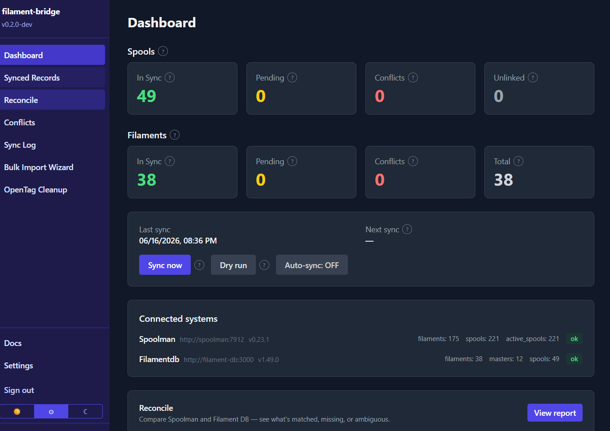
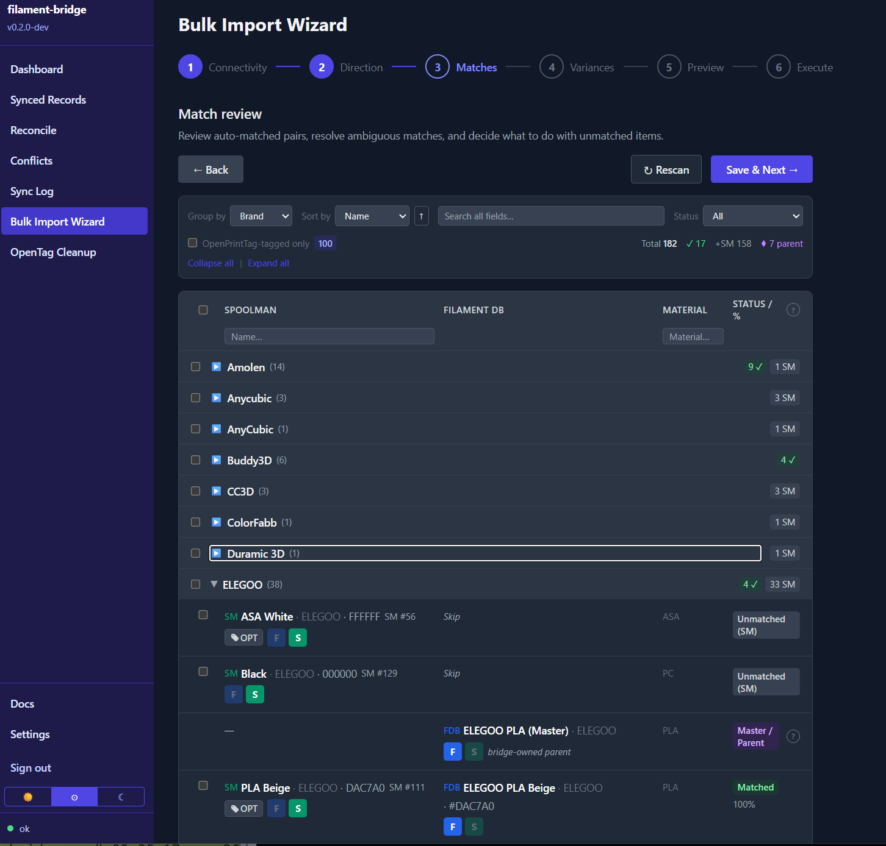
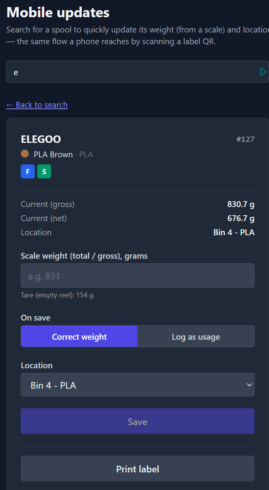
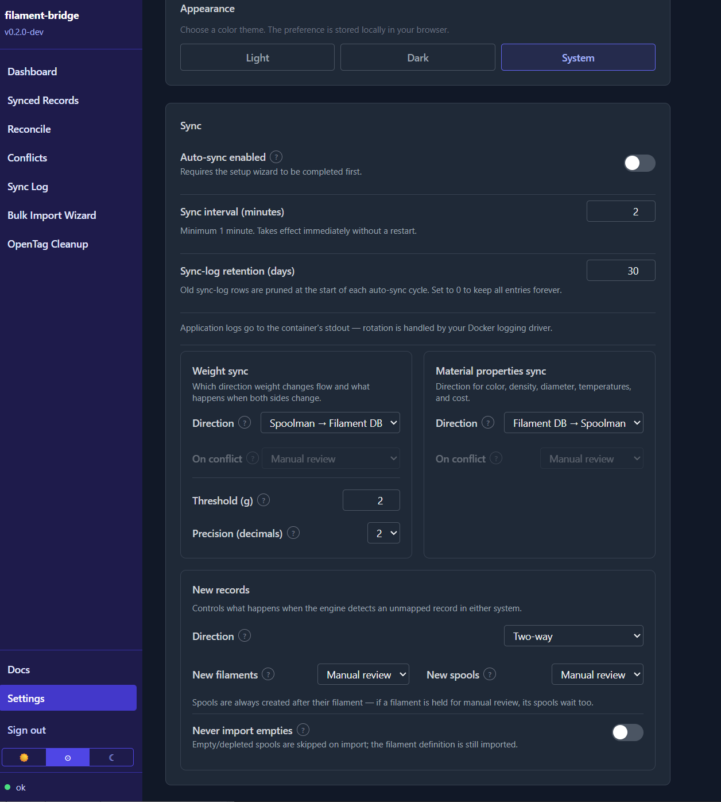
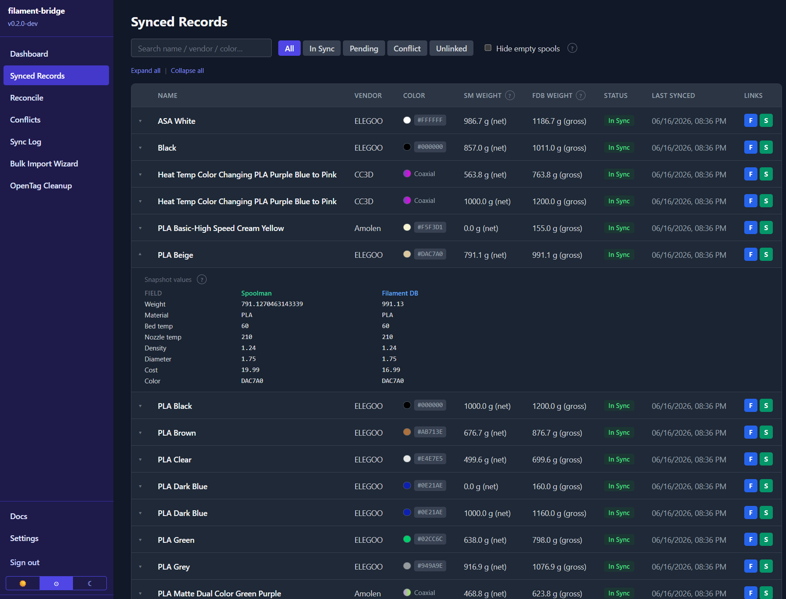
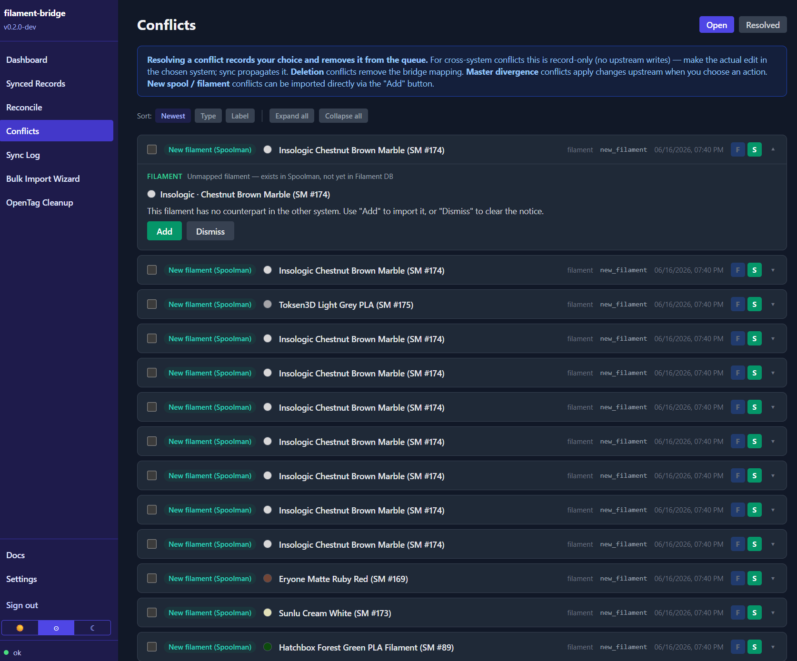
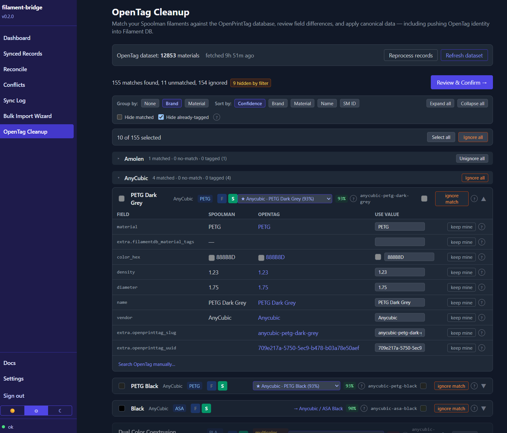

<p align="center">
  <picture>
    <source media="(prefers-color-scheme: dark)" srcset="docs/images/logo-dark.png">
    
  </picture>
</p>

<p align="center">
  
</p>

Bidirectional sync between [Filament DB](https://github.com/hyiger/filament-db) and [Spoolman](https://github.com/Donkie/Spoolman) for 3D printing filament management.

> ## ⚠️ BETA — back up your databases before any writes
>
> filament-bridge is **beta** software that writes to both **Spoolman** and **Filament DB**.
> **Before** running the Bulk Import Wizard, applying an OpenPrintTag cleanup, or enabling
> auto-sync, **back up all three databases** (Spoolman, Filament DB, and the bridge). See
> [Backups](#backups). Test against non-critical data first.

<p align="center">
  
</p>

---

## Why?

Filament DB and Spoolman are both excellent tools that solve different parts of the filament management problem:

- **[Filament DB](https://github.com/hyiger/filament-db)** excels at material profile management — deep slicer integration (PrusaSlicer, OrcaSlicer, Bambu Studio), per-printer/nozzle calibration storage, material science properties, NFC tag support, and AI-powered data sheet import.
- **[Spoolman](https://github.com/Donkie/Spoolman)** is a long-standing inventory solution with native connections to OctoPrint, Moonraker/Klipper, and Home Assistant (among others), plus a broad surrounding ecosystem. If you want to start using Filament DB but still rely on features Spoolman offers, this tool lets you combine both experiences instead of choosing one.

filament-bridge keeps the two in sync so you can use both without manual data entry. It runs as a single Docker container next to your existing instances, links records via Spoolman extra fields and Filament DB spool labels, and keeps its own state in SQLite — neither upstream system is ever modified beyond its documented REST API.

It also cleans up your spool and brand names in Spoolman against [OpenPrintTag](https://openprinttag.org) before pushing that standardized data into Filament DB — automating what would otherwise be tedious manual data hygiene.

It was built out of a real migration: moving filament management into Filament DB while keeping Spoolman fully working, because OctoPrint and Home Assistant talk to it directly and aren't going anywhere. That last part is why this is a continuous two-way sync, not a one-time export.

There are **two ways to onboard**: just bridge the two systems and create your Filament DB records straight from Spoolman, or do a little cleanup work against OpenPrintTag first so your catalog lands standardized and Filament DB can keep pulling canonical updates later. **[Getting started](docs/getting-started.md) walks through both paths** and helps you pick.

---

## What it does

- **Bulk Import Wizard** — a re-runnable six-step wizard (Connectivity → Direction → Matches → Variances → Preview → Execute) that pairs the two systems: fuzzy vendor+name+color matching with bulk actions, variant grouping with per-group tare and property reconciliation, a full dry-run preview with collision rename/skip, and a per-record execute report that isolates failures so one bad record never aborts the batch
- **Continuous sync engine** — polls both APIs on a configurable interval and diffs against last-known snapshots; syncs spool weights, material/density/diameter, spool & net filament weights, bed/nozzle temperatures, cost, structured multicolor/gradient colors, OpenPrintTag finish tags, spool location, and archive/retire lifecycle state
- **Per-category direction + conflict policy** — weight, material properties, and new-spool creation each have an independently configurable sync direction (`two_way` / one-way) and conflict policy (`manual` / `spoolman_wins` / `filamentdb_wins`; `newest_wins` for weight only)
- **Usage-logged weight sync** — Spoolman weight decrements become Filament DB usage entries (preserving the audit trail), never raw weight overwrites; net↔gross weight-model translation is automatic
- **Conflict queue** — when both sides change the same field between cycles, the change is queued for human decision; conflicts are never silently auto-resolved. Master-divergence conflicts (a Spoolman value that would override an inherited Filament DB variant setting) get a dedicated resolve workflow: apply to the whole line, make it the variant's own setting, or ignore
- **Variant model translation** — understands Filament DB's parent/variant hierarchy and builds it from flat Spoolman filaments, either by promoting one color to parent or by creating a colorless container parent per line (your choice — see [variant parent mode](docs/variant-parent-mode.md))
- **OpenPrintTag cleanup tool** — matches your Spoolman filaments against the OpenPrintTag community database, lets you review every field, applies canonical data to Spoolman, and stamps the OpenPrintTag slug/UUID into Filament DB
- **Upstream-deletion handling** — a deletion on one side queues a conflict when a live, linked counterpart needs protecting; stale links with nothing to protect are purged from the bridge automatically
- **Web UI** — Dashboard, Synced Records (expandable per-field side-by-side detail, conflict deep-links), Conflicts, Sync Log (per-cycle windows), Settings; every record links straight to its page in Filament DB and Spoolman; light/dark/system theme
- **Mobile updates & label printing** — print a QR-coded spool label and scan it with your phone to open a single-purpose page that updates the spool's **weight** (read off a scale, with a live net preview) and **location** in one tap — written straight to Filament DB and Spoolman. The QR encodes a stable bridge redirect, so labels can be re-targeted later (e.g. to a future Filament DB page) **without reprinting**. Labels print through a self-hosted **[LabelForge](https://github.com/crzykidd/labelforge)** instance using a template you design; the bridge fills the brand / color / number / QR. Off by default — enable and configure in **Settings → Mobile & Labels**. (QR *rendering* needs a recent LabelForge build; text-only labels print on any version.) See [mobile updates & labels](docs/mobile-updates.md)
- **Authentication** — single-account password login (on by default) with an optional API token for machine access; see [Security](#security)
- **Optional pre-write backup** — a friendly (non-blocking) backup prompt before the three write actions (wizard Execute, OpenPrintTag Apply, enabling auto-sync) offers one-click Spoolman and Filament DB backups; the Settings Danger-Zone debug actions keep a stricter confirm
- **Backup & restore** — export/import the bridge's own state (mappings, config, open conflicts) as JSON, plus a **nightly scheduled backup** job (bridge state + a Filament DB snapshot, with configurable retention) — see [backups](docs/backups.md)
- **Version badge + update check** — the sidebar shows the running version and surfaces new GitHub releases (checked server-side, cached 6 h)
- **Debug reset tools** — a gated Danger Zone (off by default) with three reset tools for clean re-testing: clear Spoolman cross-refs, reset the bridge DB, or both at once





---

## What's New

### v0.6.12 (2026-07-12)

- **Fixed: importing a Filament DB master + variant into Spoolman** — a fresh
  Filament DB → Spoolman import no longer fails with `422 Unprocessable Entity`. The
  bridge now sends Spoolman's required `density`/`diameter` (defaulting to 1.24 / 1.75 mm
  when Filament DB leaves them unset), and synthetic parent "master" records are skipped
  instead of being pushed to Spoolman's flat model. (#61)
- **Fixed: auto-sync erroring when a filament's density/diameter is unset** — the
  material-scalar sync no longer tries to write a `null` into Spoolman's required
  `density`/`diameter` fields (which 422'd every cycle); it leaves Spoolman's valid value
  untouched. (#62)
- **Verified against Filament DB 1.66.1 and Spoolman 0.24.0** — the latest-tested-upstreams
  baseline moved up; no bridge-affecting API changes. Minimum supported versions unchanged.

### v0.6.11 (2026-07-02)

- **Security hardening from a full repository audit (Claude Fable 5)** — three fixes:
  bridge backups no longer include auth secrets (an exported/nightly backup is not a
  credential dump, and importing one can't overwrite your password or session key #57);
  the session cookie's `Secure` flag is now correct behind a TLS reverse proxy / tunnel,
  plus baseline response security headers (#58); and login now rate-limits after 5 wrong
  attempts per IP (HTTP 429, 5-minute cooldown) (#59).
- **Behind a proxy?** The bridge now trusts `X-Forwarded-Proto` and runs with
  `--proxy-headers`. A reverse proxy is still **not required** — plain-HTTP LAN use is
  unchanged; Traefik and Cloudflare Tunnel work out of the box. See
  [docs/security.md](docs/security.md).
- **New docs & clearer security model** — added Reconcile and Tare Editor guides,
  `CONTRIBUTING.md`, `SECURITY.md`, corrected the auth/session documentation, and documented
  exactly what the optional public mobile-scan mode (`mobile_session_days=0`) exposes.

### v0.6.10 (2026-07-01)

- **Unlink a pairing from the Synced Records page** — each expanded spool row now has an **Unlink** button (with a confirm dialog) to break the bridge's internal pairing. It's bridge-local: nothing in Filament DB or Spoolman is deleted or modified. (#40)
- **Clearer weights in the Synced Records detail** — the expanded Weight row now labels the Spoolman value `(net)` and the Filament DB value `(gross)`, so the (legitimately different) numbers no longer look mismatched. (#55)
- **Verified against Filament DB 1.62.0** (Spoolman 0.23.1 unchanged); minimum supported versions are unchanged.

### v0.6.9 (2026-06-30)

- **Set a spool's printer slot from your phone** — the mobile spool page now has a Printer + Slot (AMS/MMU) picker to load a spool into a slot or clear it, written straight to Filament DB. It shows the current assignment, warns if a slot already holds another spool, and blocks retired spools. (#53)
- **Clearer OpenPrintTag Cleanup controls** — the confusing match/refresh buttons are now just **Matches** (cached view) + a single **Re-match** (re-reads Spoolman *and* checks OpenPrintTag, then re-scores), with a "Last matched X ago" freshness badge. Staleness is content-aware, so renaming a vendor/filament in Spoolman now flags a re-match instead of silently showing the old value. (#52)

### v0.6.8 (2026-06-29)

- **More OpenPrintTag data saved to Spoolman** — applying an OpenTag match now also records bed, chamber, and preheat temperatures, minimum nozzle diameter, and cure wavelength as Spoolman custom fields (alongside the existing nozzle/drying/hardness/transmission fields), taken from the exact matched OpenPrintTag record. Bed temperature still syncs to Filament DB as before. (#50)

### v0.6.7 (2026-06-29)

- **Fixed: spools no longer go missing after a manual merge or reset** — a spool that exists in both Spoolman and Filament DB but had lost its bridge mapping (from a partial import, a manual merge, or a state reset) was silently skipped — invisible in Synced Records and Mobile Updates. The sync engine now re-adopts these orphaned spools automatically each cycle, and never silently drops a spool: anything it can't cleanly reconcile (e.g. a cross-ref colliding with a different already-mapped spool) is surfaced as a conflict instead. (#48)

### v0.6.6 (2026-06-28)

- **Log a dry cycle from the mobile spool page** — the mobile scan/update card now has a dedicated "Log dry cycle" section (temperature, duration, optional notes), pre-filled from the filament's recommended drying settings. It logs straight to Filament DB on its own button — separate from Save — and the card shows the last-dried date and total cycle count. (#45)
- **Fixed: Conflict "Add" no longer breaks after a sync cycle** — during a large migration the bridge re-issued each new-filament/new-spool conflict with a new id every cycle, so clicking **Add → Link to existing filament** failed with "No conflict with id …" and greyed out the import. Conflict ids are now stable across cycles. (#44)
- **Verified against Filament DB 1.59.3** (Spoolman 0.23.1 unchanged); minimum supported versions are unchanged.

### v0.6.5 (2026-06-27)

- **Fixed: Bulk Import Wizard crash** — the Spoolman → Filament DB Variances step threw "Cannot access … before initialization" and showed an error page, making imports in that direction impossible (regression from the v0.6.3 required-tare change). It now renders correctly, guarded by a regression test. (#42)
- **Sortable columns on Synced Records** — click a column header to sort by Name, Vendor, Spoolman weight, Filament DB weight, or Last synced (click again to reverse). (#41)

### v0.6.4 (2026-06-27)

- **Wizard completes on partial success, with a persistent Failure Report** — a single failed record no longer leaves a mostly-successful import marked "not done." Failed records are now saved durably (survive navigation/reload): the Dashboard shows a banner when the last import had failures, linking to a Wizard Import Report that lists the failures first (with the reason) then the successes, and offers a one-click **Re-run wizard** (idempotent — already-imported records are skipped). (#14)

### v0.6.3 (2026-06-27)

- **Wizard now requires a tare when none is known** — instead of silently assuming a 200 g reel weight (which poisons every spool's gross weight and all future sync for that filament), the Bulk Import Wizard's Variances step leaves an unknown tare blank and required, and won't let you continue until it's filled. (#13)
- **Search box on the mobile scan page** — after scanning a label and updating a spool, type a name, vendor, color, or spool number to jump straight to another spool — no re-scanning. Works on both the logged-in and public scan flows. (#36)
- **Backup status in the UI** — the Dashboard shows a Last/Next backup row, and Settings → Scheduled backups shows last-run outcome, next fire time, and retained-file count/size, with the UTC run-hour annotated in your local timezone. (#20)

### v0.6.2 (2026-06-25)

- **Tare Editor now works for variant-organised libraries** — if your filaments are grouped into variant clusters, the editor showed no checkboxes and nothing could be edited. Every filament is now selectable, and the list is **grouped by variant family** with a per-family header you can tick to set one tare across all of a line's colours at once. (#34)
- **Update / release-notes pop-up no longer appears stuck inside the sidebar** — after the 0.6.1 mobile-nav change, the post-upgrade and "update available" modals rendered as a small box pinned in the nav sidebar instead of centered over the app. They overlay the full window again. (#33)

### v0.6.1 (2026-06-25)

- **Tare Editor** — a new page to fix the empty-reel tare weight (Filament DB `spoolWeight` / Spoolman `spool_weight`) for many filaments at once, without re-running the Bulk Import Wizard. Lists every mapped filament with its tare on both sides, flags missing/mismatched ones, and lets you set a value per row or apply one to a multi-selected batch; saving writes both systems and keeps them from drifting. Variants are read-only (they inherit tare from their parent). (#26)
- **Collapsible navigation on mobile** — on phone-width screens the side nav now tucks away behind a hamburger in a slim top bar and slides in over a dimmed backdrop, so the content gets the full width.
- **Logo & favicon** — a proper logo now appears in the sidebar, on the login page, and in the README, with a theme-aware browser favicon.
- **Fixes** — OpenPrintTag Cleanup no longer shows filaments as changed when nothing actually differs ("0 fields changed", #31); sync-log retention now prunes even when auto-sync is off — via manual syncs, the nightly backup, and at startup (#22).

### v0.6.0 (2026-06-24)

- **Mobile updates & label printing** — print a QR-coded spool label and scan it with your phone to update the spool's **weight** (from a scale, with a live net preview) and **location** in one tap, written straight to Filament DB and Spoolman. The QR encodes a stable bridge redirect so labels can be re-targeted without reprinting; labels print through a self-hosted **[LabelForge](https://github.com/crzykidd/labelforge)** instance using a template you design. Off by default — enable in **Settings → Mobile & Labels**. See [mobile updates & labels](docs/mobile-updates.md).
- **Configurable mobile-scan auth** — a new `mobile_session_days` setting controls whether scanning a label needs the app password and how long a scan login lasts (`0` makes the scan flow public; `>= 1` keeps it behind login with an N-day session).
- **Spool location now syncs continuously** — moving a spool to a new shelf in either system propagates to the other (a new `location_sync` category with its own direction + conflict policy), not just at wizard import. (#29)
- **Scheduled nightly backups** — a built-in nightly job saves the bridge's own state plus a Filament DB snapshot and prunes by a configurable retention window, all toggleable in **Settings → Scheduled backups**.
- **Fixes** — lowering a spool's weight now actually reaches Filament DB via a usage entry (#28); OpenPrintTag drying time is stored in the correct unit (minutes, #27); resolving a cross-system conflict now writes your choice to both systems and converges instead of re-queuing (#21).
- **Changelog housekeeping** — release notes for 0.4.0 and earlier are now condensed summaries with full detail archived under `docs/CHANGELOG-0.x.x.md`.

### v0.5.1 (2026-06-22)

- **Archived spools no longer read as deleted** — the bridge was requesting archived Spoolman spools with a parameter Spoolman ignores, so it only ever saw active spools. Once a spool was archived (e.g. mirrored from a retired Filament DB spool) it disappeared from view and the next sync raised a false **"upstream record deleted (spoolman)"** conflict. The bridge now uses Spoolman's `allow_archived` parameter; archived spools stay visible and mirror correctly, any false deletion conflict already queued auto-resolves on the next sync, and archived spools are again visible to the Bulk Import Wizard.
- **Bulk Import Variances: attaching to an existing master is clearer** — when a group attaches to an existing Filament DB parent, that parent is shown as the master and the confusing per-color "master" radio/pill and reconcile-against-master box are dropped (display-only; the import outcome is unchanged).

### v0.5.0 (2026-06-22)

- **OpenPrintTag material settings now sync into Filament DB** — seven standardized settings Spoolman can't store natively (nozzle temp min/max, drying temperature, drying time, Shore A/D hardness, transmission distance) are captured as typed Spoolman extra fields and mirrored to/from their Filament DB counterparts. The OpenTag **Apply** flow populates them from the matched material, and ongoing sync keeps them current under the material-properties direction/policy.
- **OpenTag weight-model bonus** — when the matched OpenPrintTag material has package/container data, Apply also offers to set Spoolman's native `spool_weight` (empty-reel tare) and `weight` (nominal full net weight), so the weight model starts accurate.
- **Bulk Import Match step shows each Spoolman filament's active spool count** — every record shows its number of non-archived spools (amber when zero), making it obvious why a filament whose only spools are empty/archived won't carry a spool into Filament DB.
- **Bulk Import fixes** — a filament whose only spools are empty/archived is no longer half-imported (skips the filament too, not just the spool); finish-line names are no longer doubled (e.g. `Buddy3D PLA Silk Silk Pink` → `Buddy3D PLA Silk Pink`); a single new color now attaches to its existing Filament DB master instead of importing standalone; and a stale "skip" override no longer blocks importing under an existing master.
- **Fewer phantom conflicts** — empty spools no longer spam `new_spool` conflicts when "skip empty & archived" is on, and lingering such conflicts auto-resolve.

### v0.4.0 (2026-06-21)

- **Sync Log shows record names** — each log row now has a "Record" column with the human-readable filament/spool name (resolved from the mapping, with a live-Spoolman fallback for not-yet-mapped records), so triaging "why didn't X import" is much easier.
- **OpenPrintTag badge on the Variances step** — filaments tagged in OpenPrintTag show an "OPT" pill, so you can pick the OPT-backed one as master (it carries the standardized settings).
- **In-app release notes render as Markdown** — fixes the odd wrapping in the update-available and post-upgrade modals.
- **Bulk Import fix (generic-container)** — adding new variants under a master that already exists in Filament DB now attaches them to that master instead of skipping the whole cluster on a false "name collision".

### v0.3.1 (2026-06-21)

- **Bulk Import Wizard fix** — new Spoolman colors shown checked-by-default on the Match step are now actually imported when you click **Next** without toggling each one. Previously those untouched rows were silently dropped, so the Execute step created nothing in Filament DB — most visibly when adding new color variants under an existing "use existing master" parent. Unchecking a row still skips it.

### v0.3.0 (2026-06-19)

A big OpenPrintTag-focused release plus broad UX polish:

- **OpenPrintTag Cleanup overhaul** — renamed throughout to **OpenPrintTag**; an idle landing toolbar (Refresh dataset · Match to DB · Show missing values), inline **unmatch / change-match** from the candidate dropdown, and the dropdown now shows for single-candidate brands
- **Faster & smarter** — matching runs off the event loop (a match no longer freezes the bridge) with a cached result; **smart dataset refresh** does a cheap commit-SHA check and only re-downloads the tarball when OpenPrintTag actually changed ("Pull contents anyway" forces it)
- **Contribution audit** — "Show missing values" now audits the OpenPrintTag database (not your spools): for the records you own it lists every supported field — across material, packages, and containers — that the community DB leaves empty, with per-field toggle chips (remembered per browser) so you decide what's worth submitting
- **Version awareness** — an **"Update Available"** pill (daily check) and a one-time **release-notes modal after you upgrade**
- **UX polish** — consistent **Back/Next bars on top and bottom** of every wizard/commit step; the pre-write backup prompt is now **friendly and optional** (debug actions keep a strict confirm); wizard Match **select-all** works reliably across groupings
- **Fixes** — Dashboard spools-vs-filaments / master-count clarity (#3); tooltips no longer clipped by the sidebar/header

### v0.2.1 (2026-06-17)

- **Bidirectional archive/retire sync** — a synced spool's lifecycle state now mirrors both ways (archive in Spoolman ↔ retire in Filament DB), with the final weight settling before the archive bit propagates so nothing lands with a stale weight (FR-21)
- **Fix** — the Filament DB color now shows in Synced Records for solid filaments instead of "—" (#2)
- **Fix** — the Dashboard's Filament DB line breaks out real filaments vs synthetic master/container parents, and the Spools/Filaments sections read as distinct counts rather than a mismatch (#3)
- **Fix** — help tooltips are no longer clipped by the sidebar or page header

### v0.2.0 (2026-06-15)

First public release. The bridge is feature-complete for two-way sync between Filament DB and Spoolman:

- **Bulk Import Wizard** — re-runnable six-step wizard with fuzzy matching, variant grouping, dry-run preview, and per-record execute reporting
- **Continuous sync engine** — snapshot/diff/apply loop with per-category sync direction + conflict policy (two-axis model) for weight, material properties, and new-spool creation
- **Conflict queue** — conflicts are always queued for human decision, never silently resolved; includes the master-divergence resolve workflow for variant inheritance
- **OpenPrintTag cleanup tool** — match Spoolman filaments against the community dataset, review per field, and stamp canonical slug/UUID into both systems
- **Variant parent modes** — `promote_color` or `generic_container`, building Filament DB's parent/variant hierarchy from Spoolman's flat list
- **Weight-model translation** — net↔gross conversion with Spoolman decrements logged as Filament DB usage entries (audit trail preserved)
- **Structured multicolor/gradient, finish-tag, and bed/nozzle temperature sync**
- **Minimum upstream version enforcement** — sync is hard-gated below Filament DB 1.33.0 / Spoolman 0.22.0
- **Single-account auth + optional API token**, light/dark/system theme, version badge with GitHub update check, and a pre-write backup safeguard

See [CHANGELOG.md](CHANGELOG.md) for the full list.

---

## Quick start (Docker)

[`docker-compose.yml`](docker-compose.yml) is the standard bridge-only deployment — it pulls the published image and points at your existing Filament DB and Spoolman instances. Copy it, fill in your URLs, and run:

```bash
docker compose up -d
```

To add the bridge to an existing compose file:

```yaml
services:
  filament-bridge:
    image: ghcr.io/crzykidd/filament-bridge:latest
    restart: unless-stopped
    ports:
      - "8090:8090"
    volumes:
      - bridge-data:/data        # REQUIRED — persists the SQLite state database
    environment:
      FILAMENTDB_URL: http://your-filament-db-host:3000   # your existing Filament DB
      SPOOLMAN_URL: http://your-spoolman-host:7912         # your existing Spoolman
      # SYNC_INTERVAL_SECONDS: 120
      # See docs/configuration.md for all options

volumes:
  bridge-data:
```

> **Note:** the `bridge-data:/data` volume is required. Without it, all bridge state (mappings, sync history, wizard progress) is lost on every container restart.

For a full local stack (bridge + Filament DB + MongoDB + Spoolman) for development or testing, use [`docker-compose.dev.yml`](docker-compose.dev.yml) instead:

```bash
docker compose -f docker-compose.dev.yml up -d --build
```

### First run

New to the bridge? **[docs/getting-started.md](docs/getting-started.md)** explains the two
onboarding paths (just-bridge-them vs. clean-up-against-OpenPrintTag-first) and walks through
each. The short version:

1. Open `http://localhost:8090`. The bridge asks you to **set an admin password**
   (authentication is on by default — set `AUTH_ENABLED=false` to skip it).
2. Pick a **variant parent mode** in Settings when prompted — the Bulk Import Wizard
   won't run in the Spoolman → Filament DB direction until you do
   ([what the modes mean](docs/variant-parent-mode.md)).
3. **Back up both systems**, then run the **Bulk Import Wizard** to pair your records.
4. Review the **dry run** from the Dashboard, then explicitly **enable auto-sync**.
   Auto-sync is always OFF until you turn it on.

---

## Prerequisites

**Minimum supported versions — sync is disabled below these:**

| System | Minimum supported | Why |
|---|---|---|
| **Filament DB** | **1.33.0** | structured multicolor/gradient, finish-tag, and temperature sync |
| **Spoolman** | **0.22.0** | structured multi-color fields (`multi_color_hexes` / `multi_color_direction`) and the stable extra-fields system used for cross-reference IDs |

These minimums are **enforced, not advisory.** When the bridge can read an upstream's version and
it is below the minimum, **sync is hard-gated**: the sync trigger, dry-run, and the Bulk Import
Wizard all refuse with *"Sync disabled — upgrade … to use"*, and scheduled auto-sync cycles are
skipped. The bridge still starts and the UI loads — the Dashboard and `GET /api/health` surface a
per-system warning explaining why sync is off — so you can see and fix it. An **unknown/unreadable**
version does *not* block sync (that is treated as a connectivity issue, surfaced as `degraded`
health, not as "too old").

Latest tested upstreams: **Filament DB 1.66.1** and **Spoolman 0.24.0**.

- **Filament DB** — the bridge gates version-specific features automatically.
- **Spoolman** — the bridge creates its required extra fields (`filamentdb_id`, `filamentdb_spool_id`, etc.) automatically on startup if they are missing.
- Both upstream APIs are unauthenticated **by default**. **Filament DB ≥ 1.39.0** can optionally require an API key (FDB's own `FILAMENTDB_API_KEY`); if you enable it, set the bridge's `FILAMENTDB_API_KEY` to the same value and the bridge sends `Authorization: Bearer <key>` on every Filament DB request. Spoolman's API has no auth. (The bridge's own UI/API has its own login; see [Security](#security).)

---

## Safety model — what the bridge will never do

- **Auto-sync is OFF by default** — you must explicitly enable it after completing the wizard and reviewing the dry-run plan
- **Conflicts are never auto-resolved** — every conflict is queued for manual human decision; no silent value-picking
- **Records are never deleted** from either upstream system without explicit user action in the bridge UI
- **Weight decrements are logged as usage entries** in Filament DB (via `POST /api/filaments/:id/spools/:spoolId/usage`), preserving the full usage-history audit trail
- **No upstream code modification** — the bridge uses only the documented REST APIs and Spoolman's extra field system; neither Filament DB nor Spoolman is forked or patched

Every field the bridge writes to Spoolman, and when, is enumerated in
[docs/spoolman-writes.md](docs/spoolman-writes.md).

---

## Backups

**Before running the Bulk Import Wizard, applying an OpenPrintTag cleanup, or enabling auto-sync, back up all three systems.** The pre-write safety dialog offers one-click backups of both upstreams; the same endpoints are available directly:

### Spoolman

Trigger a safe server-side backup via the API (Spoolman does not need to be stopped; it copies its database into a `backups/` folder inside its own data volume):

```bash
curl -X POST http://<spoolman-host>:7912/api/v1/backup
```

Make sure Spoolman's data volume is itself persisted/copied — the backup file lands inside that volume.

### Filament DB

Filament DB exposes `GET /api/snapshot` — a full JSON backup of all collections. Restore with `POST /api/snapshot` (destructive).

**One-click via the bridge:** the pre-write safety dialog's "Back up Filament DB now" button calls `POST /api/backup/filamentdb`, which downloads the snapshot to the bridge's data volume (`DATA_DIR/backups/filamentdb-snapshot-<timestamp>.json`).

```bash
curl http://<fdb-host>:3000/api/snapshot -o fdb-snapshot.json
```

Or back up the raw MongoDB volume:

```bash
docker exec <mongo-container> mongodump --archive=/data/db/fdb-$(date +%F).archive
```

### filament-bridge

Export the bridge's own state (mappings, runtime config, open conflicts) from Settings → Backup, or:

```bash
curl http://<bridge-host>:8090/api/backup/export -o bridge-backup.json
```

Restore with `POST /api/backup/import`.

### Scheduled nightly backups

The bridge runs a built-in nightly job (on by default) that writes the bridge-state export
and a Filament DB snapshot into `DATA_DIR/backups/` and prunes files past a retention
window (default 7 days). Spoolman is intentionally excluded — the bridge can't prune
Spoolman's own archives. Toggle the two backups, the retention window, and the UTC run hour
(default `03:00`) in **Settings → Scheduled backups** (env fallback: `BACKUP_*`). Full
details in [docs/backups.md](docs/backups.md).

**Audit log — `changes.log`:** every write the bridge makes to Spoolman or Filament DB is appended to `{DATA_DIR}/changes.log` (default `/data/changes.log`). Each line shows a UTC timestamp, action, target system, entity id, and old → new values for updates — useful for reviewing what changed after a bad release without needing the UI or the SQLite database. The file rotates automatically at ~10 MB (keeps 3 backups). Disable with `CHANGES_LOG_ENABLED=false`. Pairs with `DEBUG_STARTUP_DUMP` (point-in-time boot snapshot) for a full before/after picture.

---

## How sync works

### Per-category direction and conflict policy

Each data category is configured independently on two axes in Settings:

- **Sync direction** — `filamentdb_to_spoolman`, `spoolman_to_filamentdb`, or `two_way`
- **Conflict policy** — what happens when the same field changes on both sides between
  cycles (only consulted under `two_way`): `manual` (queue for human decision, the default),
  `spoolman_wins`, `filamentdb_wins`, or `newest_wins` (weight only — Spoolman exposes no
  per-filament modification timestamp)

Defaults: weight syncs Spoolman→FDB; material properties sync FDB→Spoolman; new spools and archive/retire both sync two-way.



### What syncs

Beyond spool weight, the engine syncs the shared filament surface per cycle: material/type,
density, diameter, spool (tare) weight, net filament weight, bed/nozzle temperatures, cost,
structured multicolor/gradient colors, OpenPrintTag finish tags, and any extra fields you map
via `FIELD_MAPPINGS`. It also mirrors each synced spool's **archive/retire lifecycle state**
between the two systems (see [below](#archive--retire-lifecycle)). The full pass-by-pass model
lives in [docs/sync-model.md](docs/sync-model.md).



### Weight model translation

Spoolman tracks **net filament weight** (`remaining_weight` excludes the reel). Filament DB tracks **gross spool weight** (`totalWeight` includes the reel; the filament-level `spoolWeight` field is the empty-reel tare).

- Spoolman → Filament DB: weight decrements are logged as usage entries — never raw overwrites
- Filament DB → Spoolman: `remaining_weight = totalWeight − spoolWeight`

### Archive / retire (lifecycle)

Once a spool is synced, its lifecycle state stays in step across both systems: archiving a
spool in Spoolman retires it in Filament DB, and retiring it in Filament DB archives it in
Spoolman — un-archiving/un-retiring mirrors back the same way. It runs as its own category
(`archive_sync`, default `two_way` / `manual`), and the final weight always settles **before**
the archive bit propagates, so a depleted-then-archived spool never lands on the other side
with a stale weight. A one-sided change is a clean push; only a genuine both-sides divergence
queues a conflict.

This is separate from the wizard's **Skip empty & archived spools on import** setting, which
only controls whether already-dead spools are pulled in during a bulk import — it does not
affect ongoing lifecycle mirroring.

### Variant tracking

Filament DB uses parent/variant inheritance (one parent with shared settings, color variants underneath). Spoolman is flat — one filament per color. The bridge tracks the relationship via Spoolman extra fields (`filamentdb_id`, `filamentdb_parent_id`) and builds the hierarchy at import time according to your [variant parent mode](docs/variant-parent-mode.md). When a Spoolman change would override a variant's *inherited* setting, the bridge queues a master-divergence conflict instead of silently detaching the variant from its parent — you decide whether the change applies to the whole line, just that variant, or not at all.

### Conflict resolution

All conflicts are queued — never silently resolved — and shown on the Conflicts page with both values and deep links. Resolving a standard conflict records your choice; resolving a master-divergence conflict applies your chosen action upstream. Details in [docs/conflicts.md](docs/conflicts.md).



---

## Concepts

### The filament → spool hierarchy

A **filament is a container**. In Filament DB, the hierarchy is:

```
Parent filament (shared properties: material, diameter, density, temps)
  └── Variant filament (inherits parent; overrides: color, name suffix)
        └── Spool (weight, location, purchase date)
```

Spoolman is flat: every color is its own filament. The bridge builds the Filament DB
hierarchy from Spoolman's flat list at import time (Bulk Import Wizard) and maintains it
with cross-reference IDs (`filamentdb_id`, `filamentdb_parent_id`) stored in Spoolman
extra fields.

### Hold-until-filament rule

Sync flows **top-down**. A spool can only be created in the target system once its filament
exists and is mapped there. If the filament isn't mapped yet:

- Under `manual_review` (the default): a `new_filament` conflict is queued. The Conflicts
  page surfaces an **Import** button that creates the filament on the other side (powered by
  `POST /api/conflicts/{id}/import`) without leaving the page. Any spools belonging to that
  filament are held until you act.
- Under `auto_import`: the engine creates the filament automatically (same code path as the
  wizard), writes the mapping and cross-reference IDs, and releases held spools to normal
  new-spool handling.

Spools are **never silently dropped** — they wait in the conflict queue until their filament
is resolved.

### New-record policy axes

Two independent settings (Settings → New records) control this behavior:

| Setting | Values | Effect |
|---|---|---|
| `new_filament_policy` | `manual_review` (default) / `auto_import` | Queue a conflict vs auto-create for unmapped filaments |
| `new_spool_policy` | `manual_review` (default) / `auto_import` | Queue a conflict vs auto-create for unmapped spools on already-mapped filaments |

Both default to `manual_review` — no records appear in either system without a human
decision or an explicit enable.

---

## OpenPrintTag cleanup tool

The OpenPrintTag tool reconciles your Spoolman filaments with the [OpenPrintTag](https://openprinttag.org) community database — standardized identification (slugs, UUIDs, finish tags) and canonical material data — and helps you contribute back. The page opens to an **idle toolbar** (nothing loads on mount) with three actions:

- **Refresh dataset** — *smart* refresh: a cheap upstream commit-SHA check downloads the multi-MB tarball only when OpenPrintTag actually changed; otherwise it just freshens the cache age and offers a **Pull contents anyway** button.
- **Match to DB** — scores every Spoolman filament (brand pre-filter with configurable vendor aliases, color-profile + polymer-family gates, color/hex/finish-aware scoring), then per filament: the best match plus up to ten alternates, field-by-field; accept/edit/keep-mine, switch candidates, **unmatch** (clear the OpenPrintTag identity), or search manually. The match result is cached and scoring runs off the event loop, so a match never freezes the bridge. **Confirm & Apply** writes the chosen fields to Spoolman (creating vendors via find-or-create where you approved a manufacturer change) and stamps `openprinttag_slug`/`openprinttag_uuid` into both systems.
- **Show missing values** — a **contribution audit**: for the records you own, it lists every OpenPrintTag-supported field the master database leaves empty (across material, packages, and container) so you know what to go submit upstream. It audits OpenPrintTag, not your spools — your inventory only scopes which records to check.

Vendor-name and color-word mappings for the matcher are editable in Settings. Full guide: [docs/opentag-cleanup.md](docs/opentag-cleanup.md).



---

## Security

Authentication is **on by default**: the first visit asks you to set an admin password, after
which the UI and API require a login (signed httpOnly session cookie; lifetime is
configurable via `mobile_session_days`, default 30 days). An optional **API token**
(Settings → Security) allows machine access via `Authorization: Bearer <token>` or
`X-API-Key`. The optional mobile scan flow can be made public with `mobile_session_days=0` —
only do so on a trusted LAN (see [docs/security.md](docs/security.md)).

Locked out? Set `AUTH_ENABLED=false`, restart, change the password in Settings → Security,
then re-enable. The full model — crypto choices, protected routes, recovery — is in
[docs/security.md](docs/security.md).

---

## Configuration

All connection configuration is via environment variables; the service refuses to start without `FILAMENTDB_URL` and `SPOOLMAN_URL`. Most behavior settings are also editable at runtime in the Settings UI (stored in SQLite; the env var is the startup default).

| Variable | Required | Default | Description |
|---|---|---|---|
| `FILAMENTDB_URL` | **Yes** | — | Base URL of your Filament DB instance (e.g. `http://filament-db:3000`) |
| `SPOOLMAN_URL` | **Yes** | — | Base URL of your Spoolman instance (e.g. `http://spoolman:7912`) |
| `SYNC_INTERVAL_SECONDS` | No | `120` | Seconds between auto-sync cycles (runtime-editable in Settings) |
| `BACKUP_SCHEDULE_ENABLED` | No | `true` | Master switch for the nightly scheduled backup job (runtime-editable) |
| `BACKUP_BRIDGE_STATE_ENABLED` | No | `true` | Include the bridge-state export in the nightly backup (runtime-editable) |
| `BACKUP_FILAMENTDB_ENABLED` | No | `true` | Include the Filament DB snapshot in the nightly backup (runtime-editable) |
| `BACKUP_RETENTION_DAYS` | No | `7` | Delete bridge-written backups in `DATA_DIR/backups/` older than this (runtime-editable) |
| `BACKUP_HOUR_UTC` | No | `3` | UTC hour (0–23) the nightly backup runs at, minute 0 (runtime-editable) |
| `AUTH_ENABLED` | No | `true` | `false` fully bypasses authentication (also the lockout-recovery path) |
| `PUID` / `PGID` | No | `1000` | UID/GID the container process runs as (see [Permissions](#permissions)) |
| `DATA_DIR` | No | `/data` | Directory for the SQLite state database and backup files |
| `FILAMENTDB_SPOOLMAN_ID_FIELD` | No | `label` | Filament DB spool field used to store the Spoolman spool ID |
| `SPOOLMAN_FIELD_FILAMENTDB_ID` | No | `filamentdb_id` | Spoolman extra field name for the Filament DB filament ID |
| `SPOOLMAN_FIELD_FILAMENTDB_PARENT_ID` | No | `filamentdb_parent_id` | Spoolman extra field for the FDB parent filament ID (variant tracking) |
| `SPOOLMAN_FIELD_FILAMENTDB_SPOOL_ID` | No | `filamentdb_spool_id` | Spoolman extra field for the FDB spool subdocument ID |
| `SPOOLMAN_FIELD_FILAMENTDB_MATERIAL_TAGS` | No | `filamentdb_material_tags` | Spoolman extra field storing finish-tag IDs (CSV string, e.g. `16,17`) |
| `FIELD_MAPPINGS` | No | — | Comma-separated `fdb_field=spoolman_field` pairs for explicit field mapping |
| `FIELD_MAPPING_EXCLUDES` | No | — | Comma-separated field names to exclude from auto-matching |
| `VARIANT_LINE_KEYWORDS` | No | `silk,matte,satin,…` | Keywords that separate variant lines (runtime-editable) |
| `CONTAINER_PARENT_MARKER` | No | `(Master)` | Marker appended to generic-container parent names; empty = none (runtime-editable) |
| `MATERIAL_TAG_IDS` | No | (seed list) | CSV of `keyword=id` pairs overriding the default finish-tag ID map |
| `OPENTAG_VENDOR_ALIASES` | No | — | CSV of `spoolman_vendor=opentag_brand` pairs for OpenPrintTag brand matching (runtime-editable) |
| `SPOOLMAN_FIELD_OPENPRINTTAG_SLUG` | No | `openprinttag_slug` | Spoolman extra field for the OpenPrintTag slug |
| `SPOOLMAN_FIELD_OPENPRINTTAG_UUID` | No | `openprinttag_uuid` | Spoolman extra field for the OpenPrintTag UUID |
| `OPENTAG_CACHE_MAX_AGE_HOURS` | No | `24` | Hours before the locally cached OpenPrintTag dataset is considered stale |
| `BRIDGE_CHANNEL` / `BRIDGE_COMMIT` | No | `release` / — | Build channel + short SHA baked in at image build time (dev builds get a `-dev+sha` version label) |
| `DISCORD_WEBHOOK_URL` | No | — | Declared for future conflict/error notifications (delivery not yet implemented) |
| `LOG_LEVEL` | No | `info` | Logging verbosity (`debug`, `info`, `warn`, `error`) |
| `DEBUG_STARTUP_DUMP` | No | `false` | When `true`, writes a human-readable upstream-state snapshot to `{DATA_DIR}/state-dumps/` at boot (newest 10 kept). Development use only. |
| `CHANGES_LOG_ENABLED` | No | `true` | When `false`, disables the durable per-write audit log at `{DATA_DIR}/changes.log`. |
| `CHANGES_LOG_PATH` | No | `{DATA_DIR}/changes.log` | Override the path for the changes.log file. |

See **[docs/configuration.md](docs/configuration.md)** for the complete reference, including every runtime-editable setting (sync direction + conflict policy, variant parent mode, weight threshold/precision, log retention, debug mode, API token, and more).

---

## Permissions

The container starts as root, automatically `chown`s `/data` to the runtime user, then drops privileges to **uid 1000 / gid 1000** (user `app`) via `gosu`. No manual `chown` is ever needed — pre-existing root-owned volumes are corrected automatically on start.

Override the runtime uid/gid with `PUID` / `PGID` environment variables if your host uses a different uid:

```yaml
environment:
  PUID: "1001"
  PGID: "1001"
```

This applies to named volumes and bind mounts alike, including volumes created by older versions that ran as root.

---

## Architecture

```
                          ┌──────────────────────────────────────┐
                          │           filament-bridge            │
                          │                                      │
┌─────────────┐           │  - Bulk Import Wizard                │           ┌───────────────┐
│  Filament DB │◄─────────┤  - Continuous sync engine            ├──────────►│    Spoolman   │
│  (Next.js)   │  FDB API │  - Conflict queue + resolution       │  SM API   │   (FastAPI)   │
└──────┬───────┘          │  - OpenPrintTag cleanup tool         │           └───────┬───────┘
       │                  │  - Web UI (React SPA)                │                   │
       ▼                  └──────────────────────────────────────┘                   ▼
┌─────────────┐                                                          ┌───────────────────┐
│ PrusaSlicer  │                                                          │  OctoPrint        │
│ OrcaSlicer   │                                                          │  Moonraker/Klipper│
│ Bambu Studio │                                                          │  Home Assistant   │
└─────────────┘                                                          └───────────────────┘
```

Both Filament DB and Spoolman continue to function independently. filament-bridge is the glue that keeps them in sync. If the bridge goes down, both systems keep working — you just lose sync until it's back up. OctoPrint, Moonraker, and Klipper talk to **Spoolman** directly; the bridge is not in that data path.

**Stack:** Python 3.12 / FastAPI backend, React 18 / TypeScript / Tailwind frontend, SQLite state via SQLAlchemy + Alembic, APScheduler for the sync interval. Single image, single port (8090).

---

## Documentation

| Doc | What it covers |
|---|---|
| [docs/getting-started.md](docs/getting-started.md) | Why the bridge exists, the two onboarding paths, and a first-run walkthrough of each |
| [docs/configuration.md](docs/configuration.md) | Every env var and runtime setting |
| [docs/sync-model.md](docs/sync-model.md) | The sync engine: passes, snapshots, direction/policy resolution, version gating |
| [docs/wizard.md](docs/wizard.md) | The Bulk Import Wizard, step by step |
| [docs/conflicts.md](docs/conflicts.md) | Conflict types and what each resolution actually does |
| [docs/variant-parent-mode.md](docs/variant-parent-mode.md) | `promote_color` vs `generic_container`, container naming |
| [docs/opentag-cleanup.md](docs/opentag-cleanup.md) | The OpenPrintTag matcher and apply flow |
| [docs/opentag-matching.md](docs/opentag-matching.md) | OpenPrintTag v2 scorer internals (token decomposition + mined lexicons) |
| [docs/security.md](docs/security.md) | Auth model, API token, lockout recovery |
| [docs/backups.md](docs/backups.md) | Manual export/import, upstream backup proxies, and the nightly scheduled backup job |
| [docs/mobile-updates.md](docs/mobile-updates.md) | Phone scan-and-update, the QR `/r/` redirect, and LabelForge label printing |
| [docs/spoolman-writes.md](docs/spoolman-writes.md) | Every field the bridge writes to Spoolman, and when |
| [docs/version-update-check.md](docs/version-update-check.md) | Version badge and GitHub update check |
| [docs/migration-spoolman-to-filamentdb.md](docs/migration-spoolman-to-filamentdb.md) | Standalone one-time migration guide (without the bridge) |
| [docs/prd.md](docs/prd.md) | The full product spec |
| [docs/decisions.md](docs/decisions.md) | Why things are the way they are |

---

## Local development

### Prerequisites

- Python 3.12+, Node 22+
- A running Filament DB instance and a running Spoolman instance (or use `docker-compose.dev.yml` to spin up the full local stack)

### Backend

```bash
cd backend
pip install -r requirements.txt
FILAMENTDB_URL=http://localhost:3000 SPOOLMAN_URL=http://localhost:7912 \
  uvicorn app.main:app --reload --port 8090
```

### Frontend

```bash
cd frontend
npm install
npm run dev   # Vite dev server; API calls are proxied to the backend on :8090
```

### Tests

```bash
cd backend && pytest
cd frontend && npm test
```

### Database migrations

SQLite schema changes go through Alembic:

```bash
cd backend
alembic revision --autogenerate -m "description"
alembic upgrade head
```

---

## Changelog

The first release is **v0.2.0**. Per-release notes live in [CHANGELOG.md](CHANGELOG.md);
recent highlights are summarized under [What's New](#whats-new).

---

## Contributing

Contributions welcome. Please open an issue to discuss before submitting PRs for new features.

## License

[MIT](LICENSE) © crzykidd
